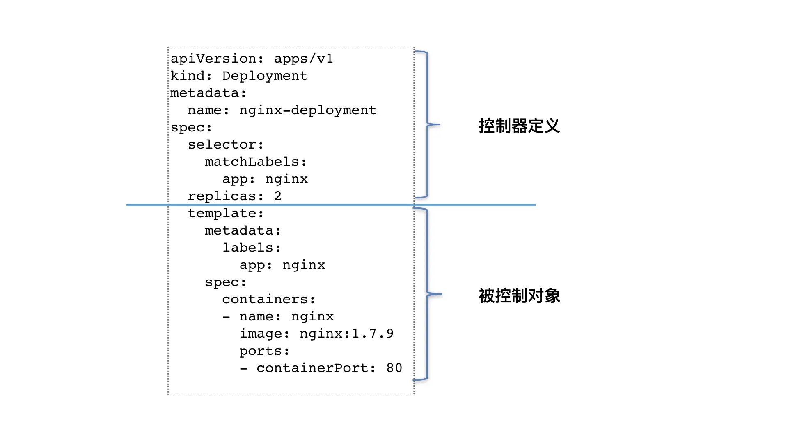

Kubernetes 项目最核心的功能：“编排”

**Pod 这个看似复杂的 API 对象，实际上就是对容器的进一步抽象和封装而已。**

“容器”镜像虽然好用，但是容器这样一个“沙盒”的概念，对于描述应用来说，还是太过简单了。这就好比，集装箱固然好用，但是如果它四面都光秃秃的，吊车还怎么把这个集装箱吊起来并摆放好呢？

所以，Pod 对象，其实就是容器的升级版。它对容器进行了组合，添加了更多的属性和字段。这就好比给集装箱四面安装了吊环，使得 Kubernetes 这架“吊车”，可以更轻松地操作它。

而 Kubernetes 操作这些“集装箱”的逻辑，都由控制器（Controller）完成。

## 最基本的控制器对象 Deployment
回顾一下这个名叫 nginx-deployment 的例子：
```
apiVersion: apps/v1
kind: Deployment
metadata:
  name: nginx-deployment
spec:
  selector:
    matchLabels:
      app: nginx
  replicas: 2
  template:
    metadata:
      labels:
        app: nginx
    spec:
      containers:
      - name: nginx
        image: nginx:1.7.9
        ports:
        - containerPort: 80
```
这个 Deployment 定义的编排动作非常简单，即：确保携带了 app=nginx 标签的 Pod 的个数，永远等于 spec.replicas 指定的个数，即 2 个。

这就意味着，如果在这个集群中，携带 app=nginx 标签的 Pod 的个数大于 2 的时候，就会有旧的 Pod 被删除；反之，就会有新的 Pod 被创建。

Kubernetes 项目中的一个叫作 kube-controller-manager 的组件, 就是一系列控制器的集合。

Kubernetes 项目的 pkg/controller 目录：
```
$ cd kubernetes/pkg/controller/
$ ls -d */              
deployment/             job/                    podautoscaler/          
cloud/                  disruption/             namespace/              
replicaset/             serviceaccount/         volume/
cronjob/                garbagecollector/       nodelifecycle/          replication/            statefulset/            daemon/
...
```
这个目录下面的每一个控制器，都以独有的方式负责某种编排功能。而我们的 Deployment，正是这些控制器中的一种。

实际上，这些控制器之所以被统一放在 pkg/controller 目录下，就是因为它们都遵循 Kubernetes 项目中的一个通用编排模式，即：控制循环（control loop）。

比如，现在有一种待编排的对象 X，它有一个对应的控制器。那么，我就可以用一段 Go 语言风格的伪代码，为你描述这个控制循环：
```
for {
  实际状态 := 获取集群中对象X的实际状态（Actual State）
  期望状态 := 获取集群中对象X的期望状态（Desired State）
  if 实际状态 == 期望状态{
    什么都不做
  } else {
    执行编排动作，将实际状态调整为期望状态
  }
}
```
**在具体实现中，实际状态往往来自于 Kubernetes 集群本身。**

比如，kubelet 通过心跳汇报的容器状态和节点状态，或者监控系统中保存的应用监控数据，或者控制器主动收集的它自己感兴趣的信息，这些都是常见的实际状态的来源。

**而期望状态，一般来自于用户提交的 YAML 文件。**

比如，Deployment 对象中 Replicas 字段的值。很明显，这些信息往往都保存在 Etcd 中。

接下来，以 Deployment 为例，我和你简单描述一下它对控制器模型的实现：
1. Deployment 控制器从 Etcd 中获取到所有携带了“app: nginx”标签的 Pod，然后统计它们的数量，这就是实际状态；
2. Deployment 对象的 Replicas 字段的值就是期望状态；
3. Deployment 控制器将两个状态做比较，然后根据比较结果，确定是创建 Pod，还是删除已有的 Pod（具体如何操作 Pod 对象，我会在下一篇文章详细介绍）。

可以看到，一个 Kubernetes 对象的主要编排逻辑，实际上是在第三步的“对比”阶段完成的。

这个操作，通常被叫作调谐（Reconcile）。这个调谐的过程，则被称作“Reconcile Loop”（调谐循环）或者“Sync Loop”（同步循环）。

所以，如果你以后在文档或者社区中碰到这些词，都不要担心，它们其实指的都是同一个东西：控制循环。

而调谐的最终结果，往往都是对被控制对象的某种写操作。

比如，增加 Pod，删除已有的 Pod，或者更新 Pod 的某个字段。**这也是 Kubernetes 项目“面向 API 对象编程”的一个直观体现。**

被控制对象的定义，则来自于一个“模板”。比如，Deployment 里的 template 字段。

可以看到，Deployment 这个 template 字段里的内容，跟一个标准的 Pod 对象的 API 定义，丝毫不差。而所有被这个 Deployment 管理的 Pod 实例，其实都是根据这个 template 字段的内容创建出来的。

像 Deployment 定义的 template 字段，在 Kubernetes 项目中有一个专有的名字，叫作 PodTemplate（Pod 模板）。

这个概念非常重要，因为后面我要讲解到的大多数控制器，都会使用 PodTemplate 来统一定义它所要管理的 Pod。更有意思的是，我们还会看到其他类型的对象模板，比如 Volume 的模板。

至此，我们就可以对 Deployment 以及其他类似的控制器，做一个简单总结了：

如上图所示，**类似 Deployment 这样的一个控制器，实际上都是由上半部分的控制器定义（包括期望状态），加上下半部分的被控制对象的模板组成的。**

这就是为什么，在所有 API 对象的 Metadata 里，都有一个字段叫作 ownerReference，用于保存当前这个 API 对象的拥有者（Owner）的信息。

# 问题
那么，对于我们这个 nginx-deployment 来说，它创建出来的 Pod 的 ownerReference 就是 nginx-deployment 吗？或者说，nginx-deployment 所直接控制的，就是 Pod 对象么？
# A
deployment会创建rs,然后由rs创建pod,所以pod的owner应该是rs.

# 思考题
你能否说出，Kubernetes 使用的这个“控制器模式”，跟我们平常所说的“事件驱动”，有什么区别和联系吗？

# A
一个是主动，一个被动<br>
“事件驱动”，对于控制器来说是被动，只要触发事件则执行，对执行后不负责，无论成功与否，没有对一次操作的后续进行“监控”<br>
“控制器模式”，对于控制器来说是主动的，自身在不断地获取信息，起到事后“监控”作用，知道同步完成，实际状态与期望状态一致<br>

除了上面提到的主动与被动区别，事件往往是一次性的，如果操作失败比较难处理，但是控制器是循环一直在尝试的，更符合kubernetes申明式API，最终达到与申明一致.